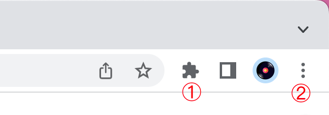
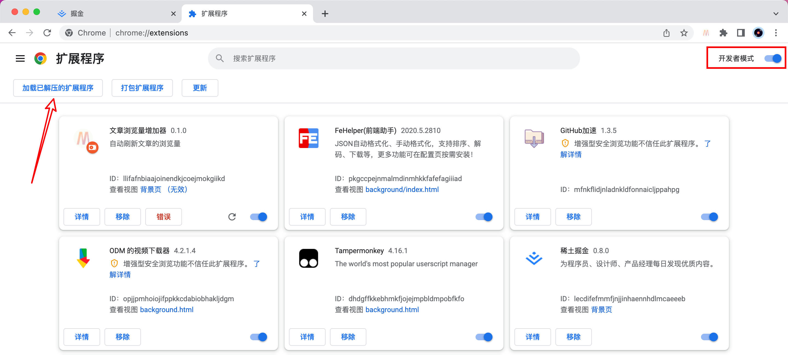
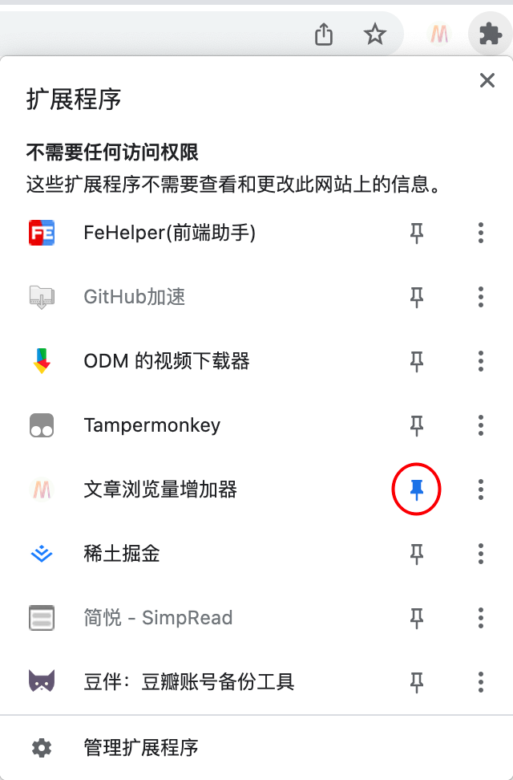
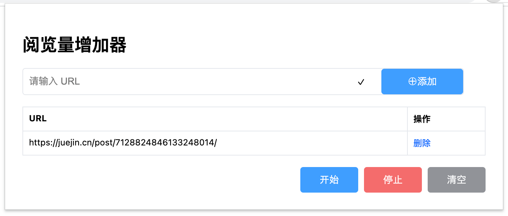

# keepUp
 文章阅览量增加器代码

### 导入扩展

> 以 Chrome 浏览器为例

1. 点击浏览器右上角工具栏①处（扩展程序）选择“管理扩展程序”，或者点击②处（自定义及控制 Google Chrome）选择“更多工具”、再选择“扩展程序”，进入扩展程序管理页面；

   

2. 打开“开发者模式”，通过“加载已解压的扩展程序”，或者直接拖拽文件夹至这个页面的方式导入扩展；

3. 导入完成后，点击①处（扩展程序），点击文章浏览量增加器的小📌，使其在工具栏显示；

   

### 使用方法

效果图

将需要增加浏览量的文章的链接填入输入框，点击“添加”按钮进行保存。

点击表格内“删除”，删除该条链接。

点击“开始”按钮，页面将不断调取该链接资源达到增加浏览量的目的。

点击“停止”按钮可以停止调取资源，让页面恢复正常。

点击“清空”按钮，已保存的文章链接将被清空。
